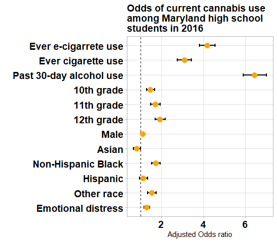

# Odds of Cannabis Use among Maryland High School Students

 

**Variable**                | **Adjusted Odds Ratio (95% CI)**
------------------------    | --------------------------------
Never e-cigarette use       | Ref
Ever e-cigarette use        | 4.18 (3.83 - 4.57)
Never cigarette use         | Ref
Ever cigarette use          | 3.09 (2.77 - 3.44)
No past 30-day alcohol use  | Ref
Any past 30-day alcohol use | 6.44 (5.91 - 7.02)
9th grade                   | Ref
10th grade                  | 1.46 (1.28 - 1.67)
11th grade                  | 1.71 (1.49 - 1.95)
12th grade                  | 1.92 (1.70 - 2.18)
Female                      | Ref
Male                        | 1.10 (1.00 - 1.20)
White                       | Ref
Asian                       | 0.82 (0.67 - 1.00)
Non-Hispanic Black          | 1.72 (1.53 - 1.94)
Hispanic                    | 1.13 (0.96 - 1.33)
Other race                  | 1.52 (1.33 - 1.74)
No emotional distress       | Ref
Any emotional distress      | 1.30 (1.17 - 1.44)